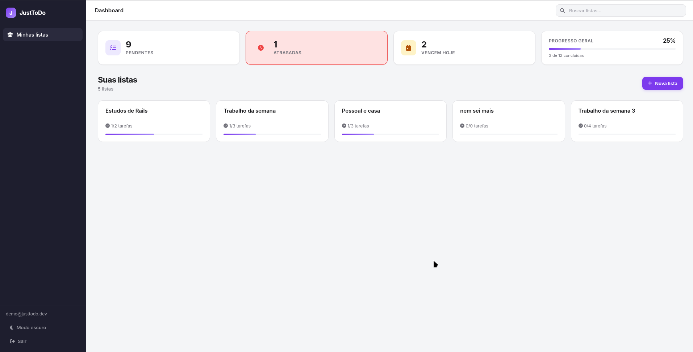
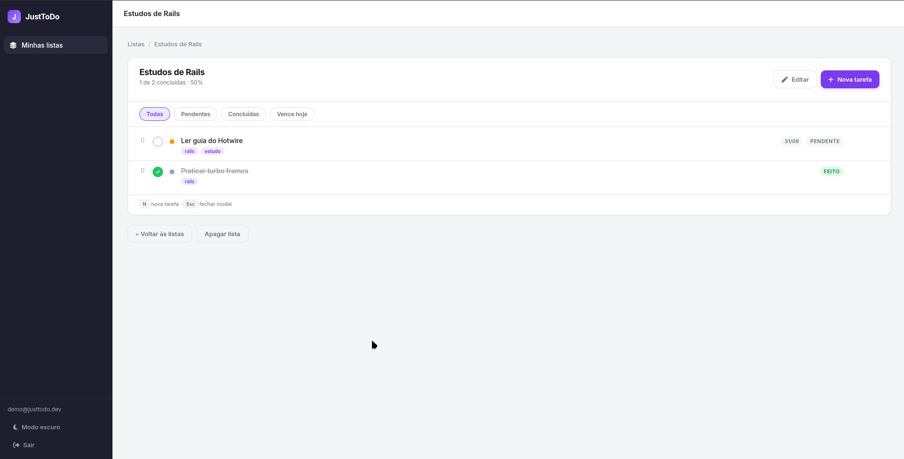
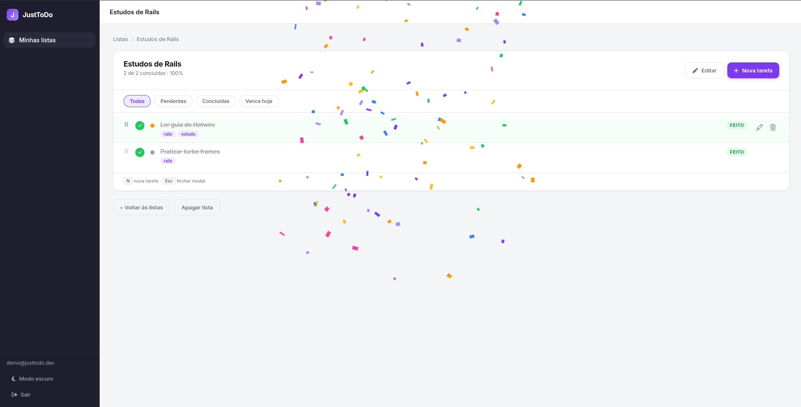

# Just To Do

Ruby 3.3.3 · Rails 7.1.4 · PostgreSQL · Hotwire

**Em produção:** [https://justtodo-b1ue.onrender.com/](https://justtodo-b1ue.onrender.com/)

Login de demonstração (seed local e produção):

- e-mail: `demo@justtodo.dev`
- senha: `Demo1234`

## Telas

Dashboard — listas, pendências, atrasadas e progresso:



Lista de tarefas — filtros, tags, prioridade e atalhos:



Lista 100% concluída:



## Rodar com Docker

1. Copie o env e gere uma `SECRET_KEY_BASE`:

```bash
cp .env.example .env
```

No `.env`, troque o valor por uma chave (por exemplo: `openssl rand -hex 64`).

2. Suba o app e o banco:

```bash
docker compose up --build
```

3. Abra [http://localhost:3000](http://localhost:3000)

O seed cria o mesmo login de demonstração acima.

Para recriar o banco e popular de novo:

```bash
docker compose run --rm web bundle exec rails db:reset
```

## Rodar sem Docker

1. Configure `config/database.yml` (ou as variáveis `DATABASE_HOST`, `DATABASE_USERNAME` e `DATABASE_PASSWORD`).
2. `bundle install`
3. `bin/rails db:prepare db:seed`
4. `bin/rails server`

## CI (GitHub Actions)

A cada push ou pull request na branch `main`/`master`, o workflow [`.github/workflows/ci.yml`](.github/workflows/ci.yml) roda:

1. **RSpec** — `db:prepare` + suite de testes (PostgreSQL 16)
2. **RuboCop** — lint com config Shopify + baseline em `.rubocop_todo.yml`

Rodar localmente (com Docker):

```bash
docker compose exec web bundle exec rubocop --parallel
docker compose exec -e RAILS_ENV=test web bundle exec rails db:prepare
docker compose exec -e RAILS_ENV=test web bundle exec rspec
```
